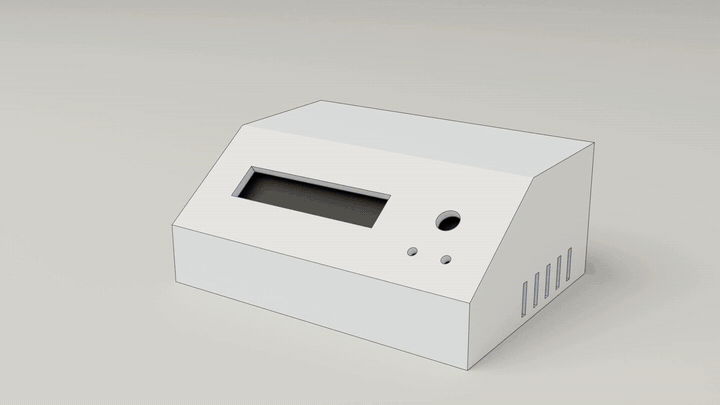
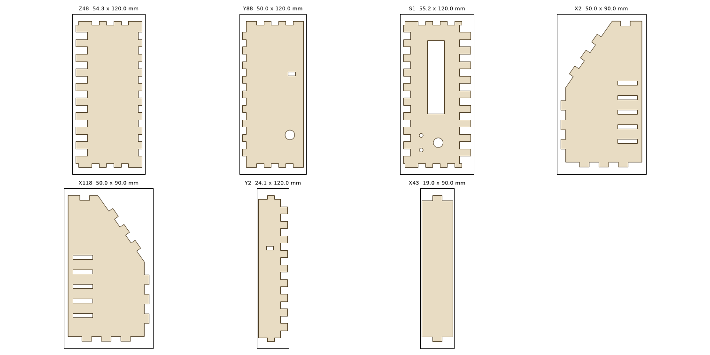
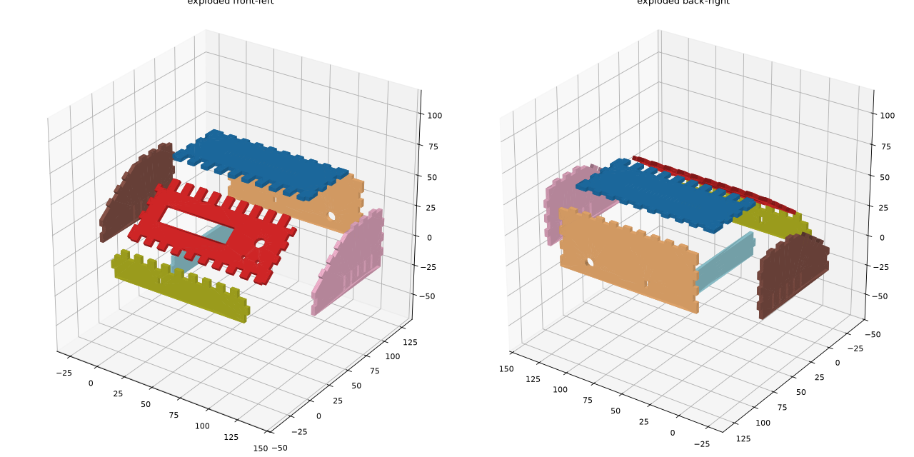
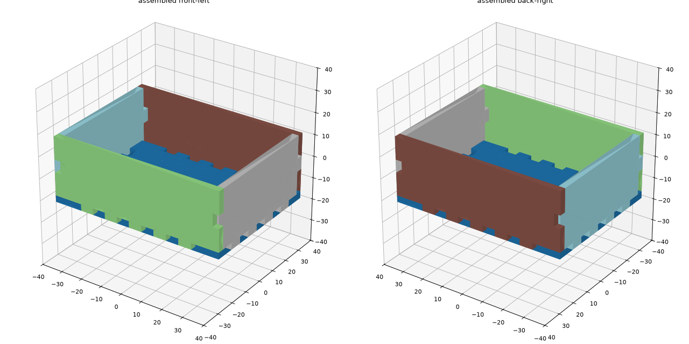

# Slotify

[](LICENSE)


<p align="center">
  
</p>

Upload a plate-based STEP model, enter your laser's kerf, get a nested DXF of a kit that clicks
together with finger joints, tabs and slots. Deterministic geometry only: no machine learning, no
network call, runs entirely on your own machine.

Box generators such as MakerCase or boxes.py start from a list of dimensions. Slotify starts from the
model you already drew, including sloped panels, windows, dividers and joints at angles other than 90°.

Born out of winning the RSA Delft robotics hackathon (Sept 2026), where the same pipeline turned a
team's Onshape robot body into a laser-cuttable kit in minutes.

## Download (Windows)

**[Download Slotify.exe](https://github.com/Gluflex/slotify/releases/latest/download/Slotify.exe)**:
no Python needed. Double-click it and the app opens in its own window; try it on one of the
[samples](samples/). It is a single ~150 MB file with the geometry kernel bundled, so the window takes a
few seconds to appear, and each kit adds about ten seconds of start-up on top of the actual computation.

The exe is not code-signed, so Windows SmartScreen may show "Windows protected your PC". Click
**More info → Run anyway**. The window uses the WebView2 runtime that ships with Windows 10 and 11; if it
is missing, Slotify opens in your browser instead.

## Quickstart (from source)

```bash
git clone https://github.com/Gluflex/slotify.git
cd slotify
pip install -r requirements.txt

python server.py                                             # web UI at http://127.0.0.1:4790
python -m step2kit samples/enclosure_demo.step --out out --kerf 0.2
python -m step2kit --box 200x150x80 --out out                # or generate a box, no STEP file needed
python tests/test_synthetic.py                                # run the test suite
```

Two ready-to-try samples ship in `samples/`:

| file | what it is |
|---|---|
| `simple_tray.step` | a plain open tray — a clean, warning-free run |
| `enclosure_demo.step` | a sloped-front enclosure with a display window, a knob, vents and an internal divider — the same part used to validate joints at non-90° angles |

<p align="center">
  
</p>

## What the model must look like

Everything the tool produces is a plate: a region of constant thickness between two parallel planar
faces. It accepts

- a single shelled solid (a box with walls, partitions, sloped plates, windows, arches),
- several plate bodies that touch each other (butt contacts) or already overlap at the corners, or
- a **plain closed solid with no walls at all** — it gets auto-shelled to your chosen wall thickness
  before the rest of the pipeline runs.

Plates may meet at any angle. Plates that were extruded vertically instead of perpendicular to their
surface (a common CAD shortcut for ramps) are detected by their wrong thickness and re-thickened behind
their outer face. Fillets across the thickness and curved shells are approximated as flat facets; solid
interiors are not plates and are reported as ignored volume.

## Pipeline (`step2kit/`)

| module | job |
|---|---|
| `slabs.py` | thickness detection (area-weighted histogram of material depth behind planar faces), plate extraction per seed face, de-duplication, re-thickening |
| `prep.py` | auto-shell filled solids to a wall thickness, auto-facet curved surfaces |
| `joints.py` | pair geometry (intersection line, dihedral angle, per-plate in-plane direction), overlap ownership, interface bars, classification FINGER / TAB / CROSSLAP from where each plate's material continues, segmentation, analytic box cuts in each plate's frame, priority trim |
| `flatten.py` | mid-plane section to shapely polygons, kerf offset (kerf/2 per side, mitred), thin-feature detection |
| `nest.py` | shelf nesting with 90-degree rotation, grouped by thickness, several sheets |
| `verify.py` | rebuild every plate from its flat outline and compare volumes; assembly-order search by disassembling one plate at a time with exact swept volumes |
| `calib.py` | kerf calibration test piece: a reference plate with pre-compensated slots plus one loose tab per candidate value |
| `export.py` | DXF (layers `CUT_OUTER`, `CUT_INNER`, `ETCH`, `SHEET`), SVG per sheet, PNG previews, STEP of the kit, JSON report |
| `pipeline.py`, `cli.py` | orchestration and command line |
| `../server.py` | standard-library HTTP front end with background jobs under `jobs/` |

Joint geometry for two plates of thickness `Ti`, `Tj` meeting at dihedral angle `theta`: the tab of
plate i extends `a_i = (Tj + Ti*|cos theta|) / (2 sin theta)` on either side of the intersection line,
and the slot in plate j is `2*a_j = (Ti + Tj*|cos theta|) / sin theta` wide. The tab's projection onto j
is exactly the slot, so angled joints fit without clearance and every cut is perpendicular to its plate.

## Not sure what kerf to use?

```
python -m step2kit --kerf-test out/kerf_test.dxf
```

Writes one reference plate with a row of labeled slots, each pre-compensated for a candidate kerf
value, plus a separate loose tab per value. Cut it once on scrap; whichever tab seats snugly in its own
slot — not forced, not loose — names your real kerf.

## Outputs per job

`kit.dxf`, `kit_sheetN.svg`, `kit_plates.png`, `kit_assembly.png`, `kit_exploded.png`, `kit.step`,
`kit_report.json`. The report lists every interface with its joint type, every part with its size and
notes, the maximum overlap between parts (must be 0), the reconstruction check and the assembly order.

<p align="center">
  
</p>

<p align="center">
  
</p>

## Known limits

- Kerf must be measured on the machine (cut a test comb, or use `--kerf-test` above); the tool cannot
  know it in advance.
- Nesting is bounding-box based; oddly shaped parts waste sheet.
- Fully closed boxes are reported as not assemblable by rigid moves; that is correct, they need
  flexing or a lid designed to slide.
- Mitred plate ends in the input are cut back to square ends.
- Built and tested on Windows. The web UI (`server.py`) and the standalone build (`step2kit.spec`)
  assume Windows paths; the core CLI (`python -m step2kit`) has no OS-specific code but is untested
  elsewhere.

## Building the standalone .exe yourself (optional)

A prebuilt `Slotify.exe` is attached to every [release](https://github.com/Gluflex/slotify/releases).
To build it from source:

```bash
pip install -r requirements-build.txt
pyinstaller step2kit.spec                                    # writes dist/Slotify.exe
```

Not required to use the tool — `python server.py` and `python -m step2kit` run directly from source.

## Contributing

Issues and pull requests welcome. Run `python tests/test_synthetic.py` before submitting a change; it
builds five synthetic parts covering open/closed boxes, cross-laps and filled solids, and checks the
joint counts and warnings the pipeline reports for each.

## License

MIT — see [LICENSE](LICENSE).
